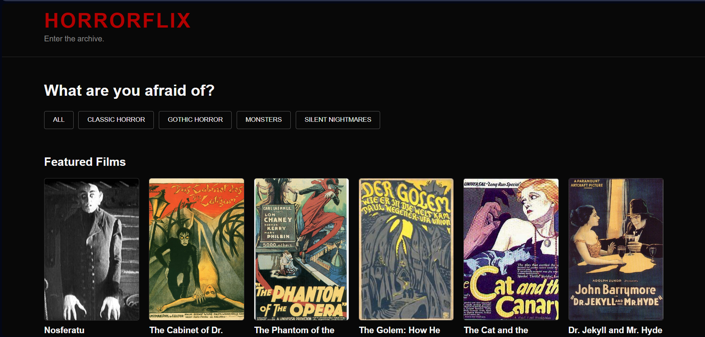

# 🩸 HORRORFLIX

> **Enter the archive.**

## 🌐 Live Demo

Explore the project online: **[Open Horrorflix](https://sarahcore.github.io/horrorflix/)**

Horrorflix is an interactive web archive dedicated to classic horror cinema.

The project was created as a way to practice front-end development while exploring one of my personal interests: horror movies. Instead of recreating a traditional streaming platform, I chose to build a small digital archive where users can browse classic films by horror subgenre and learn more about each title.

## 🕯️ About the Project

Horrorflix presents a collection of classic horror films in an interactive catalog.

Users can browse the complete archive or filter the collection by categories such as:

- Classic Horror
- Vampires
- Monsters
- Silent Nightmares

Each movie is displayed as a card containing its poster, title, year and category.

Selecting a movie opens a modal with additional information and a synopsis, allowing the user to explore the archive without leaving the main page.

## ✨ Features

- Interactive horror movie catalog
- 12 classic horror films
- Category filtering
- Dynamic movie cards generated with JavaScript
- Movie information and synopsis modal
- Poster artwork for each film
- Responsive layout for desktop and mobile devices
- Hover interactions and visual feedback
- Dark horror-inspired interface

## 🛠️ Technologies

- **HTML5** — page structure
- **CSS3** — layout, styling and responsive design
- **JavaScript** — movie data, dynamic rendering, filters and modal interactions

No frameworks or external JavaScript libraries were used.

## ⚙️ How It Works

The movie information is stored as JavaScript objects.

Each movie contains information such as its title, year, category, poster and synopsis.

JavaScript dynamically creates the movie cards and inserts them into the page.

When a category button is selected, the movie array is filtered and the interface is rendered again using only the films from that category.

Clicking a movie card opens a modal containing more information about the selected film.

This approach allowed me to separate the movie data from the HTML structure and avoid manually creating every card in the page.

## 🎨 Design

The visual identity was inspired by classic horror cinema and film archives.

I used:

- A nearly black background
- Deep red accents
- Light text for contrast
- Poster-focused movie cards
- A minimal interface that keeps attention on the films

The goal was to create something that feels more like entering a small horror archive than browsing a modern streaming service.

## 📁 Project Structure

- `index.html` — main page structure
- `style.css` — visual styling and responsive layout
- `script.js` — movie data and interactive functionality
- `assets/posters/` — movie poster images
- `assets/horrorflix-preview.png` — project preview image

## ▶️ How to Run

1. Download or clone this repository.
2. Open the project folder.
3. Open `index.html` in a web browser.
4. Explore the archive and use the category buttons to filter the films.
5. Click a movie card to view its synopsis.

No installation or additional dependencies are required.

## 🧠 What I Practiced

While developing Horrorflix, I practiced:

- Structuring a web page with semantic HTML
- Styling interfaces with CSS
- CSS Grid
- Responsive design with media queries
- JavaScript arrays and objects
- Functions
- Loops and array methods
- DOM manipulation
- Event listeners
- Filtering data dynamically
- Rendering content with JavaScript
- Building and controlling a modal interface
- Organizing assets and project files

## 💡 What I Learned

One of the main things I explored in this project was how JavaScript can be used to generate and update an interface based on data instead of keeping all content hard-coded in HTML.

Building the category system also helped me understand how the same dataset can be filtered and rendered differently depending on user interaction.

The project also gave me more practice connecting HTML, CSS and JavaScript as different parts of the same interface.

## 🚀 Possible Future Improvements

Horrorflix is currently a small front-end project, but possible future versions could include:

- Search by movie title
- Additional films and categories
- Sorting by release year
- Favorites
- More detailed movie information
- Improved accessibility and keyboard navigation
- Additional archive and discovery features

## 🎞️ Film & Image Note

Horrorflix was created as an educational, non-commercial project.

The project focuses on classic films, and poster or promotional imagery should only be included when its usage rights or public-domain status have been appropriately verified.

Horrorflix does not host or stream the films themselves.

## 👩‍💻 Author

Created by **Sarah Ellen**.

Computer Engineering + Cybersecurity student exploring technology through hands-on projects.

*Learning by doing.*
